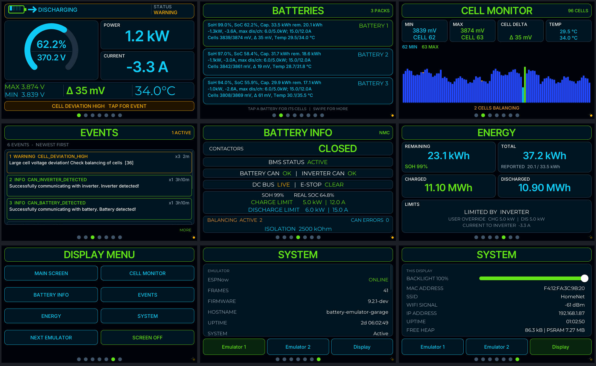

# Battery-Emulator-Esphome

An ESPHome touch display for [Battery-Emulator](https://github.com/dalathegreat/Battery-Emulator).
It listens to the emulator's ESP-NOW telemetry (protocol v2, read-only, no router hop) and shows
it on a Guition ESP32-S3 panel in the look of
[sort282-rgb/battery-display-esp32-4848s040c](https://github.com/sort282-rgb/battery-display-esp32-4848s040c),
built with ESPHome's LVGL component.

`be-monitor_2.yaml` is the config to compile. It needs ESPHome **2026.9.0** or newer.




(The three screens of the [same config](be-monitor_2.yaml), rendered from the ESPHome host build with simulated emulator frames: 480x480, 480x320 and 800x480.)

## Setup

1. `secrets.yaml`: `wifi_ssid`, `wifi_password`, `wifi_ssid_hif`, `wifi_password_hif`,
   `ota_password`, `encryption_key`, `vnc_password`.
2. Emulators, at the top of `be-monitor_2.yaml`: name and STA MAC of up to three
   (`emulator_N_name` / `emulator_N_mac`). Set a MAC to `""` to switch that emulator off: it
   gets no peer and no button, NEXT EMULATOR skips it, and with one left the panel only deals
   with that one. Keep at least one.
3. Your display, under `packages:` - exactly one line uncommented:

   ```yaml
   packages:
     ui_layout: !include pak/zz_ui_layout.yaml
     display_hw: !include pak/zz_hw_guition_4848s040.yaml
     # display_hw: !include pak/zz_hw_guition_jc3248w535.yaml
   ```

   Leave `ui_layout` above the hardware line: ESPHome reads packages bottom to top, and the
   layout is worked out from the size the hardware pak states.
4. On the emulator, enable ESP-NOW. Leave "ESPNow receiver MACs" empty (broadcast) or list this
   display's MAC. The display has to be on the same Wi-Fi channel (in practice: the same access
   point).
5. The fonts come from Google Fonts at build time, so the first compile needs internet access.

The emulator you pick on SYSTEM (or with NEXT EMULATOR) is remembered across restarts.

## Displays

| Pak | Board | Screen |
|---|---|---|
| `pak/zz_hw_guition_4848s040.yaml` | Guition ESP32-S3-4848S040 | 480x480, ST7701S RGB, GT911. Verified. |
| `pak/zz_hw_guition_jc3248w535.yaml` | Guition JC3248W535 | 320x480 QSPI panel used as 480x320 landscape (`lvgl: rotation`). Not run on the board yet. |

A pak provides the chip setup (`esp32`, `psram`), the buses, the backlight output
`gpio_backlight_pwm`, the display `my_display`, the touch controller `my_touch`, and three
substitutions: `disp_w` / `disp_h` (the panel as its driver reports it) and `disp_rot` (the LVGL
rotation, 0 / 90 / 180 / 270). It does not contain Wi-Fi, fonts, pages or scripts.
`pak/zz_hw_template.yaml` documents the contract; copy it to add a display.

### The user interface follows the screen

Nothing in the pages is a pixel number. `pak/zz_ui_layout.yaml` turns the screen size into
tokens:

* a **square** screen (480x480) gets the reference layout;
* a **landscape** screen (width at least 1.25 x height) gets a compact arrangement of the same
  pages: the SOC arc beside POWER / CURRENT, a shorter bottom card, the pack text beside the
  pack title, and so on;
* everything is scaled by `ui_k`, 1 at 480x480 and 480x320: 0.85 at 480x272, 1.5 at 800x480,
  1.875 at 1024x600. Fonts are generated at the scaled sizes.

Each measure is written `(square, wide)` in pixels at `ui_k = 1`, so tuning the look for one
kind of screen means changing that number in `zz_ui_layout.yaml`.

Pages, each one stacked as title bar, blocks that share the remaining height, and the page dots:

| Page | Content |
|---|---|
| MAIN | Status header with animated battery, flow arrow and emulator status. SOC arc with pack voltage, power, current, cell max/min, delta (green below 100 mV, amber up to 300 mV, red above) and temperature. With several packs the cell columns show the installation's scaled remaining/total energy and max discharge/charge power. An amber (red for errors) bar links to an active event. |
| BATTERIES | One card per pack (only with more than one pack). Tap a card for its cells. |
| CELL MONITOR | All cells of the selected pack; lowest, highest and balancing cells marked. Tap or drag across the bars to read cells. |
| EVENTS | The emulator's 10 newest events. |
| BATTERY INFO | Contactors, BMS, CAN links, limits, balancing, isolation. |
| ENERGY | Remaining, total and reported energy, lifetime throughput, limits. |
| DISPLAY MENU | Shortcuts, next emulator, screen off. |
| SYSTEM | One button per configured emulator picks the one being watched and shows its diagnostics; **Display** shows this panel: backlight slider (kept across restarts), MAC, SSID, signal, IP, uptime, free heap. |

Swipe left or right (the pages wrap) or tap a page dot.

## Checked

`esphome config` and C++ code generation pass for both paks. The whole UI was also built for
ESPHome's `host` platform with an SDL window (same LVGL YAML and lambdas, LVGL 9.5.0, no
warnings) and driven with simulated Battery-Emulator frames at 480x480, 480x320, 480x272,
800x480, 1024x600 and 320x240, including the emulator selection and its restore. It has not
been run on the JC3248W535.
