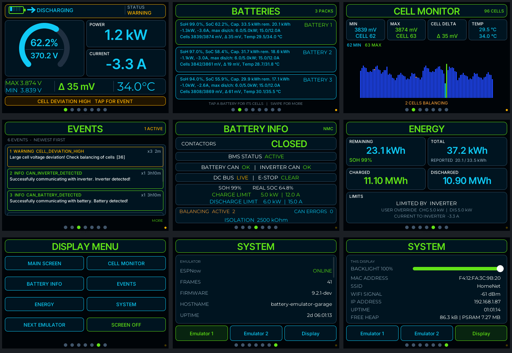
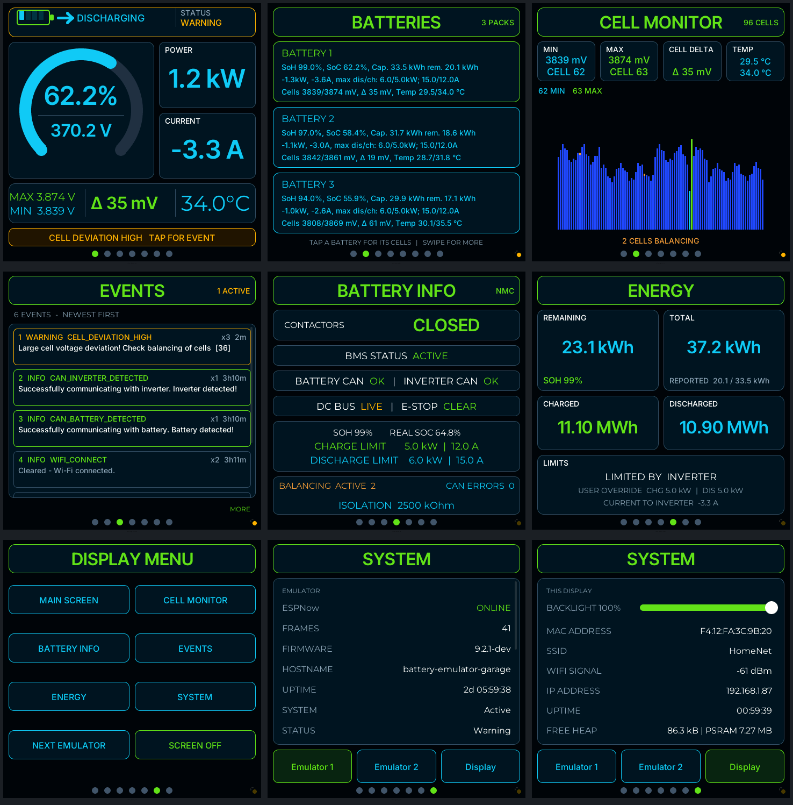

# Battery-Emulator-Esphome

An [ESPHome](https://esphome.io/) touch display for [Battery-Emulator](https://github.com/dalathegreat/Battery-Emulator).
It listens to the emulator's ESP-NOW telemetry (protocol v2, read-only, no router hop) and shows
it on various ESP32-based displays, in the look of [sort282-rgb](https://github.com/sort282-rgb/battery-display-esp32-4848s040c),
built with [ESPHome's LVGL component](https://esphome.io/components/lvgl/).

You can watch up to 3 independent Battery Emulators at the same time, each supporting even double and triple battery packs.

`be-monitor.yaml` is the config to compile. It needs ESPHome **2026.9.0** or newer. See [setup](#setup) below.

## Why [ESPHome](https://esphome.io/)

* **Any display:** a board is one small YAML file in `pak/`; ESPHome has drivers for many panels and
  touch controllers, and LVGL draws the same interface on all of them.
* **A lot of components:** add sensors, relays, MQTT, Bluetooth or anything else from the ESPHome
  catalogue to the same YAML; the device also appears in Home Assistant through the native API (not required though!).
* **Web UI and OTA:** the device can offer its own webserver page and takes firmware updates over
  Wi-Fi, from a browser or the ESPHome dashboard.
* **Your own build, your own security:** you compile the YAML yourself, from source you can read,
  with your own Wi-Fi credentials and keys (encrypted API, OTA password): no vendor firmware and
  no cloud account. No special build knowledge required!

480x320:


480x480:


(Two of the screens the [same config](be-monitor.yaml) is laid out for.)

Pages, each one stacked as title bar, blocks that share the remaining height, and the page dots:

| Page | Content |
|---|---|
| MAIN | Status header with animated battery, flow arrow and emulator status. SOC arc with pack voltage, power, current, cell max/min, delta (green below 100 mV, amber up to 300 mV, red above) and temperature. With several packs the cell columns show the installation's scaled remaining/total energy and max discharge/charge power. An amber (red for errors) bar links to an active event. |
| BATTERIES | One card per pack (only with more than one pack), its three lines of text centered, in one fixed font (the largest that fits the widest values a pack can report, so it never changes size while running). Tap a card for its cells. |
| CELL MONITOR | All cells of the selected pack; lowest, highest and balancing cells marked. Tap or drag across the bars to read cells (dragging over the bars does not change the page; swipe from outside the chart). |
| EVENTS | The emulator's 10 newest events. |
| BATTERY INFO | Contactors, BMS, CAN links, limits, balancing, isolation. |
| ENERGY | Remaining and total energy as the inverter is given it: the SOC window when the emulator scales its SOC, with the real values small beside them (left out when nothing is scaled). Lifetime throughput, limits. |
| DISPLAY MENU | Shortcuts, next emulator, screen off. |
| SYSTEM | One button per configured emulator picks the one being watched and shows its diagnostics; **Display** shows this panel: backlight slider (kept across restarts), MAC, SSID, signal, IP, uptime, free heap. |

Swipe left or right (the pages wrap) or tap a page dot.

## What it remembers, and what you set

* It watches up to **3 emulators** at the same time (name and MAC each), and you switch between them
  on SYSTEM or with NEXT EMULATOR. The one you picked is **saved** and watched again after a restart.
* The **display brightness** (SYSTEM > Display) is saved as well.
* Everything else - Wi-Fi, keys, the emulators' names and MACs, colours - is **hardcoded in your own
  YAML**: there is no settings page on the device, you edit the file and flash it again (over the
  air, once the first flash is done).

## Setup

0. [Set up ESPHome](https://esphome.io/install/) first. Unzip the contents of this repo to the `config` dir of ESPHome.
1. [Add](https://esphome.io/guides/security_best_practices/#using-secrets-yaml) a `secrets.yaml` with your `wifi_ssid`, `wifi_password`, `ota_password` and `encryption_key` (and
   `vnc_password` with the optional VNC package, see below).
2. Emulators, at the top of `be-monitor.yaml`: name and STA MAC of up to three
   (`emulator_N_name` / `emulator_N_mac`). Set a MAC to `""` to switch that emulator off: it
   gets no peer and no button, NEXT EMULATOR skips it, and with one left the panel only deals
   with that one. Keep at least one.
3. Your display, under `packages:` - exactly one `display_hw` line uncommented (they are all
   listed, commented out, in `be-monitor.yaml`; see [Displays](#displays)):

   ```yaml
   packages:
     ui_layout: !include pak/zz_be_mon_ui_layout.yaml
     display_hw: !include pak/zz_be_mon_hw_guition_4848s040.yaml
     # display_hw: !include pak/zz_be_mon_hw_guition_jc3248w535.yaml
     # ...
     # vnc: !include pak/zz_be_mon_vnc.yaml
   ```

   The order matters, because ESPHome reads packages bottom to top: `ui_layout` stays above the
   hardware line (its layout is worked out from the size the hardware pak states) and `vnc`
   stays below it (so the real panel stays LVGL's first display). `vnc` is optional, mirrors the screen to a
   VNC client, which can click through it; it keeps a copy of the frame in RAM, so it wants
   PSRAM. Comment it out on a board without PSRAM.
4. On the emulator, enable ESP-NOW. Leave "ESPNow receiver MACs" empty (broadcast) or list this
   display's MAC. The display has to be on the same Wi-Fi channel (in practice: the same access
   point).

The emulator you pick on SYSTEM (or with NEXT EMULATOR) is remembered across restarts.

## Displays preconfigured

The boards marked with ✅ have been run. The others are written from the
[esphome-devices](https://devices.esphome.io/) entry of the board and ESPHome's built-in display
models, and check out with `esphome config` and C++ code generation, but nobody has put them on the
real hardware yet: please test and give feedback. The screen size is
what the interface is laid out for (all sizes below have been checked in the simulator); text gets
small below about 3.5".

| Board | Screen | Tested | Pak (`pak/zz_be_mon_hw_...`) |
|---|---|---|---|
| Guition ESP32-S3-4848S040 | 480x480, ST7701S RGB, GT911 | ✅ | `guition_4848s040` |
| Guition JC3248W535 | 320x480 QSPI panel (AXS15231) used as 480x320 landscape (`lvgl: rotation`), AXS15231 touch | ✅ | `guition_jc3248w535` |
| Guition JC4827W543(C) | 480x272, NV3041A QSPI, GT911 | ❓ | `guition_jc4827w543` |
| Sunton ESP32-8048S043C | 800x480 RGB, GT911 | ❓ | `sunton_esp32_8048s043c` |
| Elecrow CrowPanel 5.0" | 800x480 RGB, GT911 | ❓ | `elecrow_crowpanel_5` |
| TuYa T3E smart screen | 480x480 ST7701S RGB, GT911 | ❓ | `tuya_t3e` |
| LILYGO T-Panel S3 | 480x480 ST7701S RGB (its init SPI runs through the XL9535 port expander), CST3240 touch (`cst328` platform, I2C 0x1A) | ❓ | `lilygo_tpanel_s3` |
| LILYGO T-Display-S3, touch version | 170x320 ST7789 used as 320x170 landscape, CST816 | ❓ | `lilygo_tdisplay_s3_touch` |
| LILYGO T-Display-S3, no touch | the same; the two buttons page through the screens | ❓ | `lilygo_tdisplay_s3` |
| ESP32-2432S028R "Cheap Yellow Display" (plain ESP32, no PSRAM: comment `vnc` out) | 240x320 ILI9341 used as 320x240 landscape, XPT2046 resistive touch | ❓ | `esp32_2432s028r` |
| The 2.4" resistive CYD (ESP32-2432S024R pinout; plain ESP32, no PSRAM: comment `vnc` out) | 320x240 ILI9342 (`mipi_spi`) as it comes (no rotation), XPT2046 resistive touch on the panel's SPI bus, backlight GPIO27 | ✅ | `esp32_2432s024r` |

A pak provides the chip setup (`esp32`, `psram`), the buses, the backlight output
`gpio_backlight_pwm`, the display `my_display`, the touch controller `my_touch` (whose
`on_release` runs the script `wake_ui`), the LVGL lists and buffer, and three substitutions:
`disp_w` / `disp_h` (the panel as its driver reports it) and `disp_rot` (the LVGL rotation,
0 / 90 / 180 / 270). It does not contain Wi-Fi, fonts, pages or scripts.
`pak/zz_be_mon_hw_template.yaml` documents the contract; copy it to add a display.

### The user interface follows the screen

Nothing in the pages is a pixel number. `pak/zz_be_mon_ui_layout.yaml` turns the screen size into
tokens:

* a **square** screen (480x480) gets the reference layout;
* a **landscape** screen (width at least 1.25 x height) gets a compact arrangement of the same
  pages: the SOC arc beside POWER / CURRENT, a shorter bottom card, and so on;
* everything is scaled by `ui_k`, 1 at 480x480 and 480x320: 0.85 at 480x272, 1.5 at 800x480,
  1.875 at 1024x600. Fonts are generated at the scaled sizes.

Each measure is written `(square, wide)` in pixels at `ui_k = 1`, so tuning the look for one
kind of screen means changing that number in `zz_be_mon_ui_layout.yaml`.

# Checked

`esphome config` and C++ code generation pass for every pak in the table. The whole UI was also
built for ESPHome's `host` platform with an SDL window (same LVGL YAML and lambdas, LVGL 9.5.0, no
warnings) and driven with simulated Battery-Emulator frames at 480x480, 480x320, 480x272, 800x480,
1024x600, 320x240 and 320x170, including the emulator selection and its restore.
